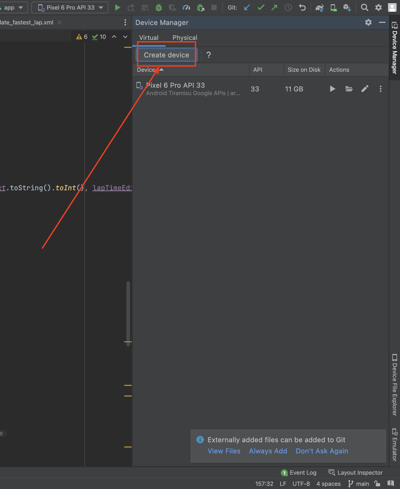

# Green Sector
A Formula 1 drivers and circuits statistics app

## **NOTES ON DATABASE**
If the app is not used within one week of inactivity Supabase will pause the project. That means none of the buttons will work. In order to get around this please contact me and I will start the project up again. Sorry about this but it is a downside of using Supabase's free tier. Thanks. Also all sql insert statements are stored in the sql folder.

## Project Summary
Green Sector provides new and existing Formula 1 fans with an easy to use and straight forward way to get / stay up to date with the current statistics of both the drivers and circuits in Formula 1. 

## App Pages
The main pages in the app are the circuit page, search page, and the driver page. 

<p align="center">  </p>

The circuit and the driver pages are both similar, listing stats across both pages. 

<p align="center"> </p>

The search page shows the selected stats based of what is chosen from the page such as Championship standings at a certain point in the season, along with the fastest lap times for all the circuits. 

<p align="center"> </p>

The user us also able to update and delete a drivers fastest lap time 

<p align="center"></p>

## ER Diagram
The ER Diagram for this app is shown below in the image. 

### Database
GreenSector uses [Supabase](https://github.com/supabase) as the backend SQL server. [Supabase-Kt](https://github.com/supabase-community/supabase-kt) is used for making connections to the database with Kotlin.

#### SQL Queries
The queries run in this project are shown below with their respective results.
#### Circuit Queries
Longest Lap Distance returns the top five longest lap distances for circuits.
````sql
create or replace function longest_lap_distance()
  returns table(circuit_name varchar, lap_distance float(8))
  language 'sql'
as $$;

select name as circuit_name, lap_distance
from circuit
order by lap_distance desc
limit(5);

$$;
````
| circuit_name | lap_distance |
| ------------ | ------------ |
| Spa          | 7.004        |
| Jeddah       | 6.174        |
| Azerbaijan   | 6.003        |
| Silverstone  | 5.891        |
| France       | 5.842        |

Longest Race Distance returns the top five longest race distances.
````sql
create or replace function longest_race_distance()
  returns table(circuit_name varchar, race_distance float(8))
  language 'sql'
as $$;

select name as circuit_name, race_distance
from circuit
order by race_distance desc
limit(5);

$$;
````
| circuit_name        | race_distance |
| ------------------- | ------------- |
| France              | 309.69        |
| Emilia-Romagna      | 309.049       |
| Singapore           | 308.706       |
| Jeddah              | 308.45        |
| Barcelona-Catalunya | 308.424       |

Fastest Lap Time Overall returns the top 5 circuits with the fastest lap time.
````sql
create or replace function fastest_lap_time_overall()
  returns table(circuit_name varchar, lap_time float(8), rank int)
  language 'sql'
as $$

select name, lap_time, lap_time_rank
from (
  select c.name, fl.lap_time,
         rank() over (partition by c.name order by fl.lap_time) as lap_time_rank
  from fastestlaptime fl join race r using (race_id) join circuit c using (circuit_id)
) ranked_times
where lap_time_rank = 1
order by lap_time asc
limit 5;

$$;
````
| circuit_name  | lap_time | rank |
| ------------- | -------- | ---- |
| Singapore     | 60.463   | 1    |
| Spa           | 65.651   | 1    |
| Red Bull Ring | 67.275   | 1    |
| Zandvoort     | 73.652   | 1    |
| Sao Paulo     | 73.785   | 1    |

Fastest Laps at Circuit(circuit_id) returns the top five fastest laps at the circuit of the users choosing.
````sql
create or replace function fastest_laps_at_circuit("id" int)
  returns table(first_name varchar, last_name varchar, lap_time float(8), name varchar)
  language 'sql'
as $$;

select first_name, last_name, lap_time, name
from driver join fastestlaptime using (driver_id) join race using (race_id) join circuit using (circuit_id)
where circuit_id = id
order by lap_time asc
limit(5);

$$;
````
| first_name | last_name  | lap_time | name   |
| ---------- | ---------- | -------- | ------ |
| Carlos     | Sainz      | 95.781   | France |
| Max        | Verstappen | 97.491   | France |
| George     | Russel     | 97.548   | France |
| Lewis      | Hamilton   | 97.668   | France |
| Sergio     | Perez      | 97.78    | France |
#### Driver Queries
Driver Wins returns the top five drivers with the most wins.
````sql
create or replace function driver_wins()
  returns table(first_name varchar, last_name varchar, wins int)
  language 'sql'
as $$;

select first_name, last_name, career_wins
from driver join driverstatistics using (driver_id)
order by career_wins desc
limit(5);

$$;
````
| first_name | last_name  | wins |
| ---------- | ---------- | ---- |
| Lewis      | Hamilton   | 103  |
| Sebastian  | Vettel     | 53   |
| Max        | Verstappen | 35   |
| Fernando   | Alonso     | 32   |
| Valtteri   | Bottas     | 10   |

Driver Podiums returns the top five drivers with the most podiums.
````sql
create or replace function driver_podiums()
  returns table(first_name varchar, last_name varchar, podiums int)
  language 'sql'
as $$;

select first_name, last_name, career_podiums
from driver join driverstatistics using (driver_id)
order by career_podiums desc
limit(5);

$$;
````
| first_name | last_name  | podiums |
| ---------- | ---------- | ------- |
| Lewis      | Hamilton   | 191     |
| Sebastian  | Vettel     | 122     |
| Fernando   | Alonso     | 98      |
| Max        | Verstappen | 77      |
| Valtteri   | Bottas     | 67      |

Driver Races returns the top five drivers with the most races.
````sql
create or replace function driver_races()
  returns table(first_name varchar, last_name varchar, races int)
  language 'sql'
as $$;

select first_name, last_name, career_races as races
from driver join driverstatistics using (driver_id)
order by races desc
limit(5);

$$;
````
| first_name | last_name | races |
| ---------- | --------- | ----- |
| Fernando   | Alonso    | 356   |
| Lewis      | Hamilton  | 310   |
| Sebastian  | Vettel    | 299   |
| Sergio     | Perez     | 235   |
| Daniel     | Ricciardo | 232   |

Driver Fastest Laps returns the top five drivers with the most fastest laps.
````sql
create or replace function driver_fastest_laps()
  returns table(first_name varchar, last_name varchar, fastest_laps int)
  language 'sql'
as $$;

select first_name, last_name, career_fastest_laps as fastest_laps
from driver join driverstatistics using (driver_id)
order by career_fastest_laps desc
limit(5);

$$;
````
| first_name | last_name  | fastest_laps |
| ---------- | ---------- | ------------ |
| Lewis      | Hamilton   | 61           |
| Sebastian  | Vettel     | 38           |
| Fernando   | Alonso     | 23           |
| Max        | Verstappen | 21           |
| Valtteri   | Bottas     | 19           |

Driver DNFS (Do Not Finish) returns the drivers with the most races not finished.
````sql
create or replace function driver_dnfs()
  returns table(first_name varchar, last_name varchar, dnfs int)
  language 'sql'
as $$;

select first_name, last_name, sum(retirement::int)
from driver join results using(driver_id)
group by first_name, last_name
order by sum(retirement::int) desc
limit(5);

$$;
````
| first_name | last_name | dnfs |
| ---------- | --------- | ---- |
| Yuki       | Tsunoda   | 6    |
| Fernando   | Alonso    | 6    |
| Alexander  | Albon     | 6    |
| Zhou       | Guanyu    | 6    |
| Valtteri   | Bottas    | 6    |

Driver Standings At returns the top five drivers with the most points at the chosen circuit.
````sql
create or replace function driver_standings_at("id" int)
  returns table(first_name varchar, last_name varchar, points int, circuit_name varchar)
  language 'sql'
as $$;

select first_name, last_name, points, name as circuit_name
from driver join driverstandings using (driver_id) join race using (race_id) join circuit using (circuit_id)
where circuit_id = id
limit(5);

$$;
````
| first_name | last_name  | points | circuit_name |
| ---------- | ---------- | ------ | ------------ |
| Max        | Verstappen | 125    | Monaco       |
| Charles    | Leclerc    | 116    | Monaco       |
| Sergio     | Perez      | 110    | Monaco       |
| George     | Russel     | 84     | Monaco       |
| Carlos     | Sainz      | 83     | Monaco       |

Driver All Average Points returns all the drivers average points per race throughout the season. The reason all 20 drivers are returned is because the user is able to select the top five highest average point finishers or the bottom five average point finishers.
````sql
create or replace function driver_all_avg_points()
  returns table(first_name varchar, last_name varchar, avg_points float(8))
  language 'sql'
as $$;

select first_name, last_name, AVG(points) as avg_points
from driver join results using (driver_id)
group by first_name, last_name
order by avg_points desc;

$$;
````
| first_name | last_name  | avg_points |
| ---------- | ---------- | ---------- |
| Max        | Verstappen | 19.6818    |
| Sergio     | Perez      | 13.2273    |
| Charles    | Leclerc    | 12.8636    |
| George     | Russel     | 11.9091    |
| Lewis      | Hamilton   | 10.5909    |
| Carlos     | Sainz      | 10.1818    |
| Lando      | Norris     | 5.27273    |
| Esteban    | Ocon       | 4.04545    |
| Fernando   | Alonso     | 3.59091    |
| Valtteri   | Bottas     | 2.13636    |
| Sebastian  | Vettel     | 1.7619     |
| Daniel     | Ricciardo  | 1.54545    |
| Pierre     | Gasly      | 1.04545    |
| Kevin      | Magnussen  | 0.954545   |
| Lance      | Stroll     | 0.818182   |
| Mick       | Schumacher | 0.545455   |
| Yuki       | Tsunoda    | 0.545455   |
| Zhou       | Guanyu     | 0.272727   |
| Alexander  | Albon      | 0.181818   |
| Nicholas   | Latifi     | 0.0909091  |

Driver All Average Finish returns the average finishing position of every driver. The reason it returns all 20 is because the user is able to choose the top five best average positions or the bottom five average positions.
````sql
create or replace function driver_all_avg_finish()
  returns table(first_name varchar, last_name varchar, avg_position float(8))
  language 'sql'
as $$;

select first_name, last_name, AVG(end_position) as avg_position
from driver join results using (driver_id)
group by first_name, last_name
order by avg_position asc;

$$;
````
| first_name | last_name  | avg_position |
| ---------- | ---------- | ------------ |
| Max        | Verstappen | 2.80952      |
| Charles    | Leclerc    | 3.31579      |
| Carlos     | Sainz      | 3.5          |
| Sergio     | Perez      | 3.95         |
| George     | Russel     | 4.38095      |
| Lewis      | Hamilton   | 5.38095      |
| Lando      | Norris     | 7.8          |
| Esteban    | Ocon       | 8.2          |
| Fernando   | Alonso     | 8.64706      |
| Valtteri   | Bottas     | 10.4118      |
| Sebastian  | Vettel     | 10.5556      |
| Lance      | Stroll     | 11.45        |
| Daniel     | Ricciardo  | 11.5789      |
| Pierre     | Gasly      | 11.5789      |
| Alexander  | Albon      | 12.7647      |
| Zhou       | Guanyu     | 12.8824      |
| Yuki       | Tsunoda    | 13.0625      |
| Kevin      | Magnussen  | 13.1667      |
| Mick       | Schumacher | 13.6842      |
| Nicholas   | Latifi     | 15.7059      |

## Getting Started
Installing GreenSector can be done by first installing [Android App Studio](https://developer.android.com/studio). Then you will want to clone the repository to a folder of your choosing. Once you have first installed Android App Studio and cloned the repository you can then open Android App Studio and open the cloned repository. Once GreenSector has been opened in Android App Studio you will need to create an emulator to run the app. On the right hand side of the screen, near the top right corner you will see a tab called "Device Manager".  After opening Device Manager you will want to click on "Create Device".  Choose any device you want and then select Android Image "Tiramisu".  After the device is created you will be able to run the project by selecting the green run arrow in the upper right hand corner.  The GreenSector will know run on your computer for you to enjoy.

## Current Developers
The Current head developer of the Green Sector project is [Dominic Orsi](https://github.com/DominicOrsi). An updated IOS and Android version is in the works.
